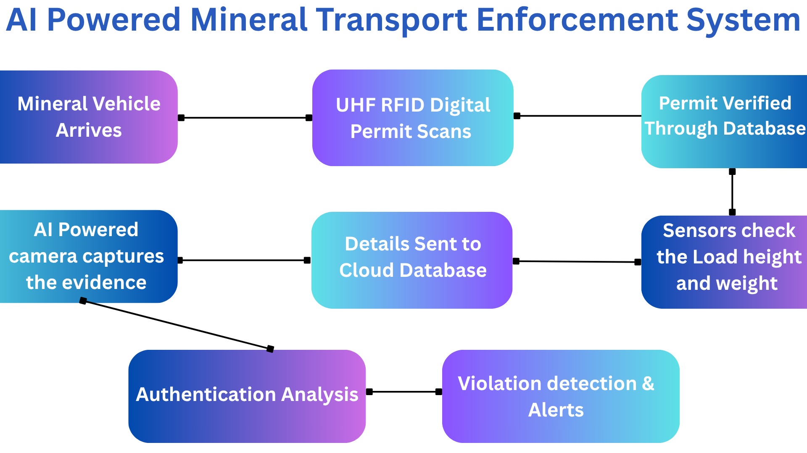

# AI-mineral-transport-enforcement

## The Problem
In Kerala ( A state In India ) Sheer volume of transport assets passes through the Borders of the State. Due to the high traffic volume, manual inspection of every vehicle becomes inefficient and error-prone, and the illegal vehicles can also use unautherised bypass routes 

## The Prototype Automation Chain
This prototype demonstrates a localized hardware-to-software automation loop designed to eliminate manual intervention:

1. A Mineral loaded vehicle approaches the automated checkpoint
2. The vehicle's Unique Digital permit is scanned using MFRC522 sensor instantly.
3. A microcontroller processes the ID and triggers a high-torque servo motor to automatically position the AI Camera its holding.
4. An active processing link on the central laptop captures a real-time snapshot and logs the transaction data instantly.

## Technology & Components 
**COMPONENTS**
1. AI powered components - Ai powered Surviellance camera at checkpoints tracks Load, Numebrplate verification ,and captures the evidence of the                                 transport  
2. Active UHF RFID tags with encrypted identity, tamper alerts and Long range scanning
3. Data aggregators connecting RFID , AI powered cameras and Sensors to backend via LTE/5G
4. High end sensor modules Lidar ( used to estimate vehicle load height), weigh in motion module (used to analyse Load weight)
5. Cloud Backend - Secure server cluster with real time data streaming using MQTT protocol, REST API layer, and encrypted storage 
6. District level Web based Enforcement Dashboard access for transport and Tax ofiicers with predictive analytics, route deviation logs, and AI-flagged violations

**TECHNOLOGY USED**
1. Computer Vision Algorithms like License plate, load, and type validation
2. Machine Learning for Violation prediction, peak-hour transport pattern analysis
3. Automated Report Generation to get Violation summary reports, heatmaps
4. Data Integration Linked to e-Transport & KOMPAS systems for permit cross-verification

## Future Improvements
1. Geo fencing Module - We can add **Geo Fencing module** to prevent Illegal trucks to bypass routes 
2. Can be scalable into nationwide
3. Citizen transparancy portal
4. Training and awarness programs for officers
5. Enable statewide alert network
6. Add cross department integration (MVD + Mining + Police)
